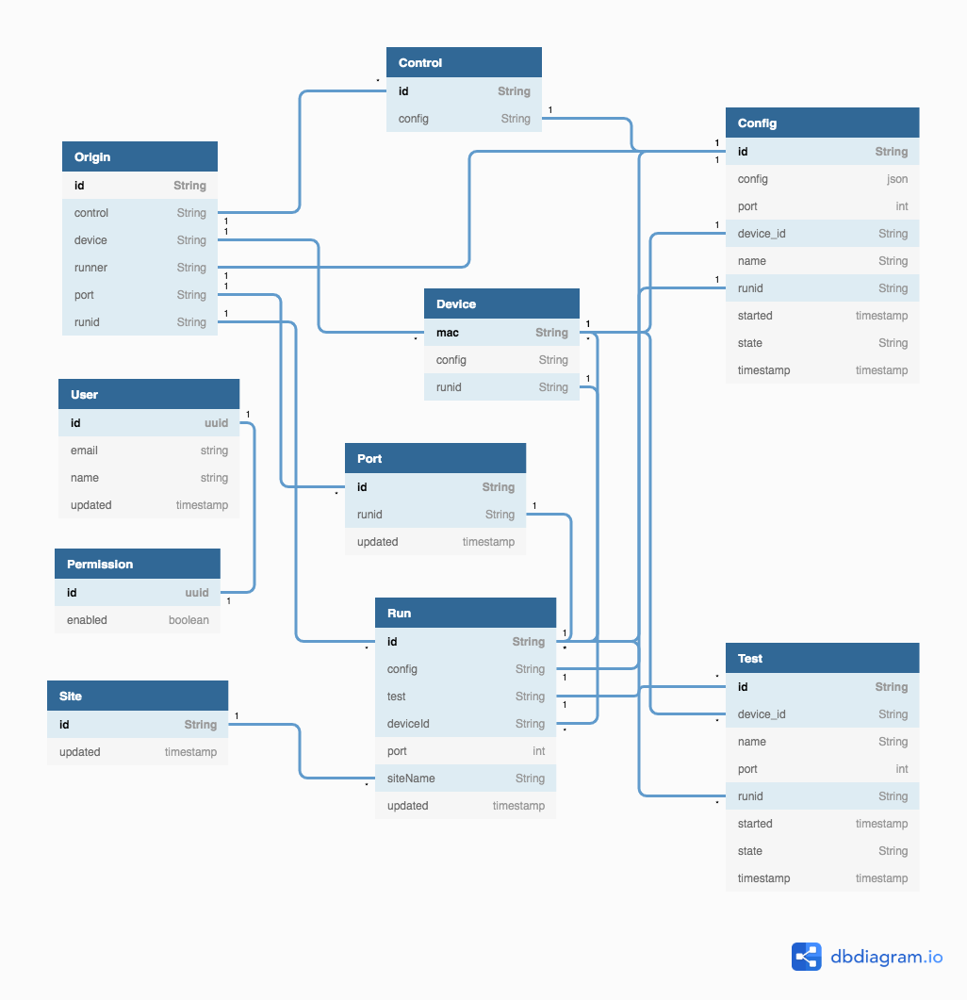

# Firebase setup instructions for DAQ.

DAQ uses a simple Firebase-hosted web page to provide a dynamic dashboard
of test results. There's three parts, which are needed at different stages
of deployment/updates.

1. _Initial setup_ (for deploying a new GCP project)
2. _Code deploy_ (to deploy a new or updated version of the code)
3. _Authentication_ (to authenticate any new users to the web page)

After this setup, or if using an already existing setup with a new DAQ install,
follow the [service account setup instructions](service.md).

## Initial Setup

Note that these instructions keep changing everytime the web-flow for Firebase changes...
it's neigh impossible to keep everything synchronized. The basic steps are always the
same, but just the details and ordering shifts now and then. Don't panic.

0. Identify a GCP project that you can to host the system. Acquire a new one if necessary.
1. Goto the [Firebase Console](https://console.firebase.google.com/) and add a new project.
   * Add the hosting GCP project to link it to this Firebase setup.
   * Chose an appropriate billing option. The _Blaze_ plan should be fine.
   * Disable Google Analytics, unless you also want to setup an account for that.
   * Continue on to add Firebase to your GCP project.
1. Enable a native mode database
   * https://console.firebase.google.com/
   * Select your project.
   * Select `Database` from the options on the left.
   * Create Database -- you do _not_ want the realtime data base or datastore mode.
   * Create it in production mode.
2. Add a web-app to the Firebase project.
   * https://console.firebase.google.com/
   * Select your project.
   * Select "+ Add app" (or this may be auto-selected for you).
   * Select "</>" (Web) to add a new web-app.
   * Use a clever nickname and register app. Not sure if/how/when this matters.
   * Enable _Firebase Hosting_
   * Skip the part about adding the Firebase SDK.
   * Follow the instructions for installing the Firebase CLI.
   * Ignore the bit about "Deploy to Firebase Hosting" for now.
3. Get your [firebase config object](https://support.google.com/firebase/answer/7015592?authuser=0) for a _web app_.
   * Copy the `const firebaseConfig = { ... }` snippet to `local/firebase_config.js`
4. Add an API key restriction:
   * Go to [API Key Restriction](https://cloud.google.com/docs/authentication/api-keys#api_key_restrictions)
   * There should be an _API Keys_ as a _Browser key (auto creatd by Firebase)_
   * Edit this, and add an _HTTP Referrer_, which will be the https:// address of the daq hosted web app: `https://your-project-name.firebaseapp.com/*`
5. Enable Google sign-in from
   * https://console.firebase.google.com/
   * Select your project.
   * Select "Authentication"
   * Select "Sign-in method"
   * Enable "Google" sign-in.

## Deploy Firebase Code

1. Install Firebase function dependencies.
   * Make sure `npm` is installed.
   * Go to <code>firebase/functions</code> and run <code>npm install</code>.
2. Enable appengine on GCP
    * Go to [GCP AppEngine console](https://cloud.google.com/appengine)
    * Enable!
3. In <code>firebase/</code>, run <code>./deploy.sh</code> to deploy to your project.
   * Follow the link to the indicated _Hosting URL_ to see the newly installed pages.
   * You will likely see an _Authentication failed_ message. See next section for details.

## Authentication

Firestore rules are enforced requiring enabled user login to access data and reports. There's
two phases to this process:
* Web-app needs to be configured and deployed with appropriate web-app credentials (see above).
* Users need to access the assigned web-app, and sign in. Initially, they will be denied access.
* The system administrator will need to run `bin/user_enable` any time there is a new user.

## Datapath Debugging

The data for DAQ reporting through to Firebase goes through a number of distinct steps. This
section outlines the basic steps to help diagnose and debug the system, past "it doesn't work!"

1. <em>DAQ GCP Connection:</em>
When the system starts up and runs, there should be some descriptive log messages that highlight
operation, with obvious error messages when something goes wrong:<pre>
<em>...</em>
INFO:gcp:Loading gcp credentials from local/daq-testlab-de56aa4b1e47.json
INFO:gcp:Initialized gcp pub/sub daq-project:daq-testlab
INFO:gcp:Initialized gcp firestore daq-project:daq-testlab
<em>...</em>
INFO:gcp:Uploaded test report to inst/report_9a02571e8f00.txt
<em>...</em>
</pre>

2. <em>PubSub Topic & Subscription:</em>
On the [GCP PubSub Topics page](https://console.cloud.google.com/cloudpubsub/topicList), there
should be an entry for a `projects/daq-project/topics/daq_runner` topic, with at least one
subscription to something like `projects/daq-project/subscriptions/gcf-daq_firestore-daq_runner`,
which is the linked Firestore cloud function.

3. <em>Cloud Function:</em>
The [GCP Cloud Functions page](https://console.cloud.google.com/functions/list) should show a
`daq_firestore` function, and if you look at the logs there should be `info` events for each
reported stage of DAQ test, e.g.:<pre>
I  daq_firestore 210626605171528 updating 1537561337615 daq-laptop port-undefined undefined status daq_firestore 210626605171528
I  daq_firestore 210625487917242 updating 1537561337804 daq-laptop port-1 5ba552f2 sanity daq_firestore 210625487917242
I  daq_firestore 210621644751867 updating 1537561338017 daq-laptop port-1 5ba552f2 info daq_firestore 210621644751867
I  daq_firestore 210625202516197 updating 1537561338223 daq-laptop port-1 5ba552f2 dhcp daq_firestore 210625202516197
I  daq_firestore 210621107285036 updating 1537561362562 daq-laptop port-1 5ba552f2 info daq_firestore 210621107285036
I  daq_firestore 210617247716870 updating 1537561362716 daq-laptop port-1 5ba552f2 dhcp daq_firestore 210617247716870
I  daq_firestore 210615717506431 updating 1537561362986 daq-laptop port-1 5ba552f2 base daq_firestore 210615717506431</pre>

4. <em>Firebase Use Logs:</em>
The same Cloud Functions are represented in Firebase and can be viewed as part of the
[Firebase Functions Usage Logs](https://console.firebase.google.com/project/daq-project/functions/usage/current-billing/execution-count)
(note that you'll have to manually replace `daq-project` with the appropriate `{projectId}` in order for that link to work).
The logs there will also show any signficant errors highlighting most problems.

5. <em>Firestore Database:</em>
The data ends up in the
[Firestore Database](https://console.cloud.google.com/firestore/data/origin?project=daq-project)
(again replacing `daq-project` with the appropraite `{projectId}`)
and filed under `origin/{accountId}` (the name of the service account) of the DAQ install supplying the data.

6. <em>Web Application:</em>
The test [Web Application](https://daq-project.firebaseapp.com/) (again, will have to substitute the appropriate `projectId`),
should show a list of all accounts with ingested data. If nothing is showing here, or the `accountId` is missing,
check the web dev console to see if there's any obvious errors.

## Configuration Data Flow

The high-level flow for configuration data is shown below. This is not a complete outlay, since
it doesn't cover all the cases, but it gives a rough indicator of how the flow works. This same
overall process applies to both the base system configuration as well as device-specific configs.
Don't take this diagram as gospel, the only true truth comes from the source.

```
+-------+                  +-----+           +-------+ +-----------+           +---------+
| Disk  |                  | DAQ |           | Test  | | Firebase  |           | WebApp  |
+-------+                  +-----+           +-------+ +-----------+           +---------+
    |         --------------\ |                  |           |                      |
    |         | DAQ startup |-|                  |           |                      |
    |         |-------------| |                  |           |                      |
    |                         |                  |           |                      |
    | Raw Config              |                  |           |                      |
    |------------------------>|                  |           |                      |
    |                         |                  |           |                      |
    |    Merged Config (aux/) |                  |           |                      |
    |<------------------------|                  |           |                      |
    |                         |                  |           |                      |
    |                         | Raw & Merged     |           |                      |
    |                         |----------------------------->|                      |
    |                         | -------------\   |           |                      |
    |                         |-| Test Start |   |           |                      |
    |                         | |------------|   |           |                      |
    |                         |                  |           |                      |
    | Merged Config (/config/device/)            |           |                      |
    |------------------------------------------->|           |                      |
    |                         |                  |           |                      |
    |                         | Merged (active)  |           |                      |
    |                         |----------------------------->|                      |
    |                         |                  |           |    ----------------\ |
    |                         |                  |           |    | Page (re)load |-|
    |                         |                  |           |    |---------------| |
    |                         |                  |           |                      |
    |                         |                  |           | Raw & Merged         |
    |                         |                  |           |--------------------->|
    |                         |                  |           |                      | ------------\
    |                         |                  |           |                      |-| JSON Edit |
    |                         |                  |           |                      | |-----------|
    |                         |                  |           |                      |
    |                         |                  |           |                  Raw |
    |                         |                  |           |<---------------------|
    |                         |                  |           |                      | -----------------\
    |                         |                  |           |                      |-| "Saving" state |
    |                         |                  |           |                      | |----------------|
    |                         |                  |           |                      |
    |                         |                  |       Raw |                      |
    |                         |<-----------------------------|                      |
    |                         |                  |           |                      |
    |            Raw & Merged |                  |           |                      |
    |<------------------------|                  |           |                      |
    |                         |                  |           |                      |
    |                         | Merged (next)    |           |                      |
    |                         |----------------------------->|                      |
    |                         |                  |           |                      |
    |                         |                  |           | Merged (next)        |
    |                         |                  |           |--------------------->|
    |                         |                  |           |                      | ----------------------\
    |                         |                  |           |                      |-| "Provisional" state |
    |                         |                  |           |                      | |---------------------|
    |                         | -------------\   |           |                      |
    |                         |-| Test Start |   |           |                      |
    |                         | |------------|   |           |                      |
    |                         |                  |           |                      |
    | Merged Config (/config/device/)            |           |                      |
    |------------------------------------------->|           |                      |
    |                         |                  |           |                      |
    |                         | Merged (active)  |           |                      |
    |                         |----------------------------->|                      |
    |                         |                  |           |                      |
    |                         |                  |           | Merged (active)      |
    |                         |                  |           |--------------------->|
    |                         |                  |           |                      | -----------------\
    |                         |                  |           |                      |-| "Normal" state |
    |                         |                  |           |                      | |----------------|
    |                         |                  |           |                      |
```

Generated with [Text Art Sequence Generator](https://textart.io/sequence) with the contents:
```
object Disk DAQ Test Firebase WebApp
note left of DAQ: DAQ startup
Disk -> DAQ: Raw Config
DAQ -> Disk: Merged Config (aux/)
DAQ -> Firebase: Raw & Merged
note right of DAQ: Test Start
Disk -> Test: Merged Config (/config/device/)
DAQ -> Firebase: Merged (active)
note left of WebApp: Page (re)load
Firebase -> WebApp: Raw & Merged
note right of WebApp: JSON Edit
WebApp -> Firebase: Raw
note right of WebApp: "Saving" state
Firebase -> DAQ: Raw
DAQ -> Disk: Raw & Merged
DAQ -> Firebase: Merged (next)
Firebase -> WebApp: Merged (next)
note right of WebApp: "Provisional" state
note right of DAQ: Test Start
Disk -> Test: Merged Config (/config/device/)
DAQ -> Firebase: Merged (active)
Firebase -> WebApp: Merged (active)
note right of WebApp: "Normal" state
```

# Firebase Database Schema
